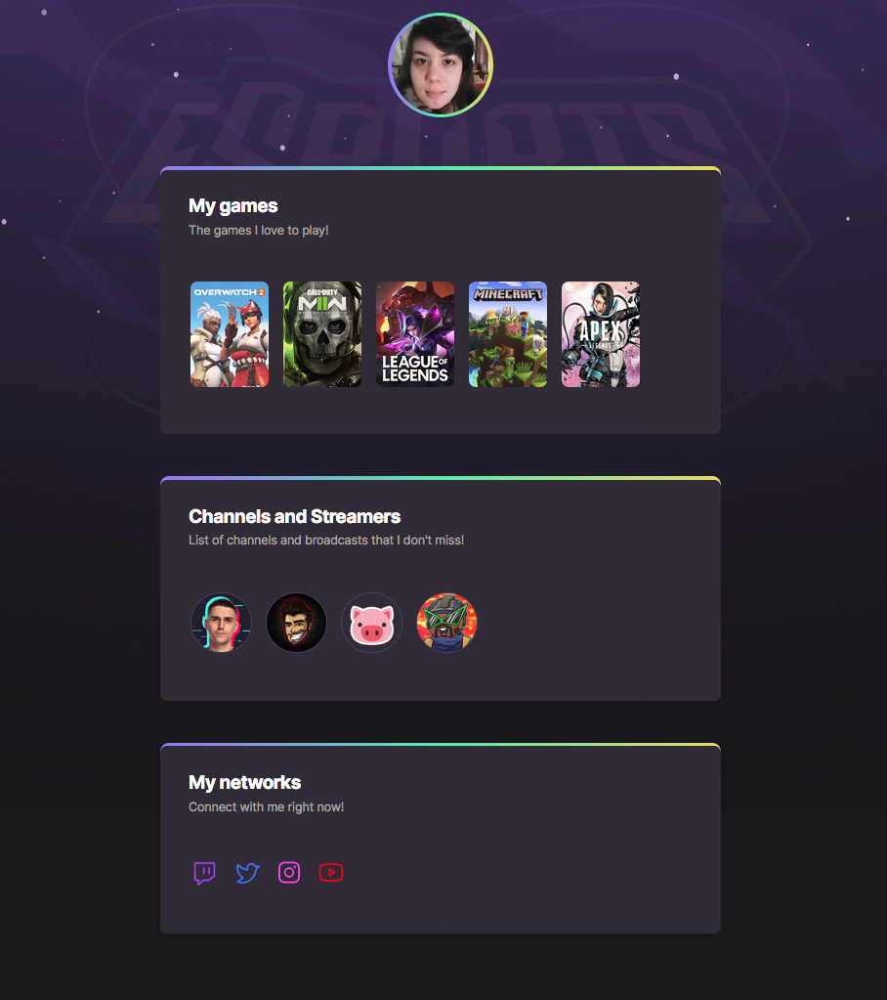

  <a href="#-tech">Technologies</a>&nbsp;&nbsp;&nbsp;|&nbsp;&nbsp;&nbsp;
  <a href="#-project">Project</a>&nbsp;&nbsp;&nbsp;|&nbsp;&nbsp;&nbsp;
  <a href="#-layout">Layout</a>&nbsp;&nbsp;&nbsp;|&nbsp;&nbsp;&nbsp;

  

  

 

  

## 🚀 Technologies

This project was developed with the following technologies:

- HTML
- CSS

## 💻 Project

In this NLW eSports the idea of ​​this project was to make a link aggregator to list your favorite games and streamers.

## 🔖 Layout

You can view the layout of the project through [this link](https://www.figma.com/community/file/1150897317533332617). You need an account on [Figma](https://figma.com) to access it.

---

Made with ♥ by sestevao :wave:
